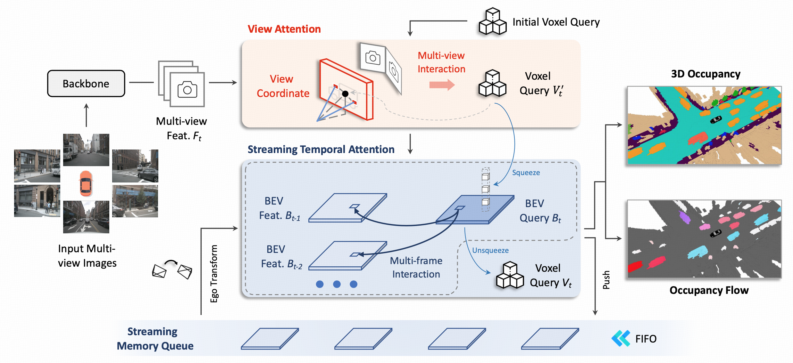
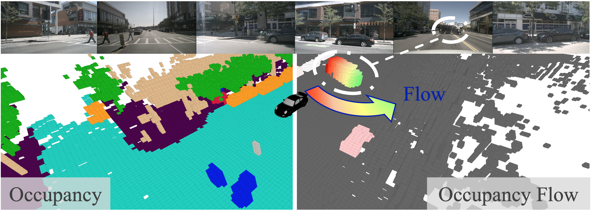

<div align="center">
<h2>Object Mask Module for Enhancing Multi-view 3D Occupancy Perception Performance Based on ViewFormer</h2>
</div>


- [2025/04]: First implementation completed.
- [2025/06]: Manuscript submitted.
- [2025/08]: Manuscript revised.
- [2025/10]: This work has been accepted for publication in the Institute of Control, Robotics and Systems (ICROS), 2025.

---

## Abstract

This study examines enhancing object detection by integrating an object-masking module into ViewFormer, a transformer-based model for 3D occupancy prediction from multi-view images. While ViewFormer effectively captures spatiotemporal information, it underperforms on small objects such as pedestrians and bicycles. To address this limitation, we designed a SegFormer-based object masking module that estimates object probabilities from BEV features and concatenates them as an additional feature channel. Experimental evaluations on the nuScenes dataset revealed an unexpected performance decline in overall metrics (mIoU, IoUgeo), particularly for small object detection. Subsequent analysis indicated weak mask activation and instability during initial training as key factors limiting the module’s effectiveness. These findings highlight the viability and constraints of object masking, underscoring the need for structural adjustments and improved training strategies to stabilize mask learning in future work.

---

## Keywords

autonomous driving, deep learning, 3D occupancy, viewformer, BEV representation, object masking

---


### Table 1. Comparison of model performance.
| Method | Training GPU | Test GPU | Training Time | Memory(G) | FPS↑ | FLOPs↓ | Params↓ | IoUgeo↑ | mIoU↑ |
|:---|:---:|:---:|:---:|:---:|:---:|:---:|:---:|:---:|:---:|
| ViewFormer | 4090*2 | - | 5D 22h | 13.7 | 12.2 | 214.74 | 99.19 M | 71.03 | 41.37 |
| Try 1 (126) CNN | 4090*2 | 4090*2 | 7D 7h | 14.1 | 6.2 | 242.14 | 99.28 M | 62.48 | 25.45 |
| Try 2 (126) CNN | 4090*2 | 4090*2 | 6D 23h | 13.7 | 12.1 | 242.14 | 99.28 M | 62.76 | 25.73 |
| Ours (126) Seg | 4090*2 | 4090*2 | 9D 5h | 16.2 | 10.7 | 249.30 | 181.21 M | 64.89 | 28.76 |

### Table 2. Performance comparison of the U-Net prediction model.
| Method | Training GPU | Test GPU | Training Time | Memory(G) | FPS↑ | FLOPs↓ | Params↓ | IoUgeo↑ | mIoU↑ |
|:---|:---:|:---:|:---:|:---:|:---:|:---:|:---:|:---:|:---:|
| ViewFormer | 4090*2 | 1/10 | - | 13.7 | - | - | 99.19 M | 65.56 | 32.23 |
| Try 3 (126) U-Net | 4090*2 | 1/10 | - | 15.1 | - | - | 130.30 M | 57.94 | 13.75 |

### Table 3. Early performance comparison when training the Seg model on a single GPU.
| Method | Training GPU | Test GPU | Training Time | Memory(G) | FPS↑ | FLOPs↓ | Params↓ | IoUgeo↑ | mIoU↑ |
|:---|:---:|:---:|:---:|:---:|:---:|:---:|:---:|:---:|:---:|
| ViewFormer | 3090*1 | 1/10 | 22D | 14.6 | - | - | 99.19 M | 62.88 | 27.36 |
| Ours - single (126) Seg | 3090*1 | 1/10 | 32D | 14.9 | - | - | 181.21 M | 62.53 | 28.28 |

### Table 4. The performance comparison by each class.
*Each value represents the average IoU score for the corresponding class.*
| Method | others | barrier | bicycle | bus | car | const. veh. | motorcycle | pedestrian | traffic cone | trailer | truck | driv. surf. | other flat | sidewalk | terrain | manmade | vegetation |
|:---|:---:|:---:|:---:|:---:|:---:|:---:|:---:|:---:|:---:|:---:|:---:|:---:|:---:|:---:|:---:|:---:|:---:|
| ViewFormer | 11.45 | 49.03 | 27.88 | 45.81 | 52.61 | 23.56 | 5.90 | 27.63 | 29.95 | 30.64 | 38.49 | 84.60 | 48.93 | 57.38 | 59.86 | 46.88 | 40.35 |
| Ours (126) Seg | 7.11 | 32.48 | 10.87 | 26.81 | 39.58 | 28.25 | 10.69 | 14.78 | 19.37 | 15.44 | 17.61 | 80.57 | 40.50 | 49.83 | 52.85 | 33.79 | 30.78 |
---
---

<div align="center">
<h2>ViewFormer: Exploring Spatiotemporal Modeling for Multi-View 3D Occupancy Perception via View-Guided Transformers</h2>
  
</div>

<video src="https://github.com/user-attachments/assets/a5856329-0210-4e3a-bbfb-16580e47ba9e" controls="controls" width="500" height="300"></video>

> **ViewFormer: Exploring Spatiotemporal Modeling for Multi-View 3D Occupancy Perception via View-Guided Transformers**, ECCV 2024
> - [Paper in arXiv](https://arxiv.org/abs/2405.04299) | [Blog in Chinese](https://zhuanlan.zhihu.com/p/706548179)

# News
- [2024/7/01]: 🚀 ViewFormer is accepted by **ECCV 2024**.
- [2024/5/15]: 🚀 ViewFormer ranks **1st** on the occupancy trick of [RoboDrive Challenge](https://robodrive-24.github.io/)!


# Abstract

3D occupancy, an advanced perception technology for driving scenarios, represents the entire scene without distinguishing between foreground and background by quantifying the physical space into a grid map. The widely adopted projection-first deformable attention, efficient in transforming image features into 3D representations, encounters challenges in aggregating multi-view features due to sensor deployment constraints. To address this issue, we propose our learning-first view attention mechanism for effective multi-view feature aggregation. Moreover, we showcase the scalability of our view attention across diverse multi-view 3D tasks, including map construction and 3D object detection. Leveraging the proposed view attention as well as an additional multi-frame streaming temporal attention, we introduce ViewFormer, a vision-centric transformer-based framework for spatiotemporal feature aggregation. To further explore occupancy-level flow representation, we present FlowOcc3D, a benchmark built on top of existing high-quality datasets. Qualitative and quantitative analyses on this benchmark reveal the potential to represent fine-grained dynamic scenes. Extensive experiments show that our approach significantly outperforms prior state-of-the-art methods.

# Methods

<div align="center">
  
</div><br/>

<div align="center">
  
</div><br/>

## Getting Started

Please follow our documentations to get started.

1. [**Environment Setup.**](./docs/setup.md)
2. [**Data Preparation.**](./docs/data_preparation.md)
3. [**Training and Inference.**](./docs/training_inference.md)


## Results on [Occ3D](https://github.com/CVPR2023-3D-Occupancy-Prediction/CVPR2023-3D-Occupancy-Prediction/tree/main)(based on nuScenes) Val Set.
| Method | Backbone | Pretrain | Lr Schd | mIoU |  Config | Download |
| :---: | :---: | :---: | :---: | :---: | :---: | :---: |
| ViewFormer | R50 | [R50-depth](https://github.com/zhiqi-li/storage/releases/download/v1.0/r50_256x705_depth_pretrain.pth) | 90ep | 41.85 |[config](projects/configs/viewformer/viewformer_r50_704x256_seq_90e.py) |[model](https://drive.google.com/file/d/1_8ZD0IvtO7_T5l4TxRflQ3q07Oa7pcKB/view?usp=sharing)|
| ViewFormer | InternT | [COCO](https://huggingface.co/OpenGVLab/InternImage/resolve/main/mask_rcnn_internimage_t_fpn_3x_coco.pth) | 24ep | 43.61 |[config](projects/configs/viewformer/viewformer_InternImageTiny_704x256_seq.py) |[model](https://drive.google.com/file/d/1meFK7NEJml6yLmQeBrqdr12NnQ_jC9Ya/view?usp=sharing)|

**Note**: 
- Since we do not adopt the CBGS setting, our 90-epoch schedule is equivalent to the 20-epoch schedule in FB-OCC, which extends the training period by approximately 4.5 times.

## Results on [FlowOcc3D](https://huggingface.co/viewformer/ViewFormer-Occ) Val Set.
| Method | Backbone | Pretrain | Lr Schd | mIoU | mAVE |  Config | Download |
| :---: | :---: | :---: | :---: | :---: | :---: | :---: | :---: |
| ViewFormer | InternT | [COCO](https://huggingface.co/OpenGVLab/InternImage/resolve/main/mask_rcnn_internimage_t_fpn_3x_coco.pth) | 24ep | 42.54 | 0.412 |[config](projects/configs/viewformer/viewformer_InternImageTiny_704x256_seq_flow.py) |[model](https://drive.google.com/file/d/1rkGHPtmryjLIZOEk-4asaDegErGOX9Uy/view?usp=sharing)|

**Note**: 
- The difference between COCO pre-trained weights and ImageNet pre-trained weights in our experiments is minimal. ImageNet pre-trained weights achieve slightly higher accuracy. We maintain the COCO pre-trained weights here to fully replicate the accuracy reported in our paper.

## Acknowledgements

We are grateful for these great works as well as open source codebases.

* 3D Occupancy: [Occ3D](https://github.com/Tsinghua-MARS-Lab/Occ3D),
[OccNet](https://github.com/OpenDriveLab/OccNet),
[FB-OCC](https://github.com/NVlabs/FB-BEV).
* 3D Detection: [MMDetection3d](https://github.com/open-mmlab/mmdetection3d), [DETR3D](https://github.com/WangYueFt/detr3d), [PETR](https://github.com/megvii-research/PETR), [BEVFormer](https://github.com/fundamentalvision/BEVFormer),
[BEVDepth](https://github.com/Megvii-BaseDetection/BEVDepth),
[SOLOFusion](https://github.com/Divadi/SOLOFusion), [StreamPETR](https://github.com/exiawsh/StreamPETR).


Please also follow our visualization tool [Oviz](https://github.com/xiaoqiang-cheng/Oviz), if you are interested in the visualization in our paper.


## Bibtex
If this work is helpful for your research, please consider citing the following BibTeX entry.
```
    @article{li2024viewformer,
        title={ViewFormer: Exploring Spatiotemporal Modeling for Multi-View 3D Occupancy Perception via View-Guided Transformers}, 
        author={Jinke Li and Xiao He and Chonghua Zhou and Xiaoqiang Cheng and Yang Wen and Dan Zhang},
        journal={arXiv preprint arXiv:2405.04299},
        year={2024},
    }
```
